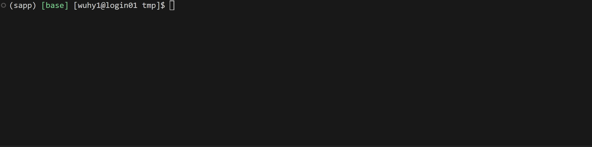
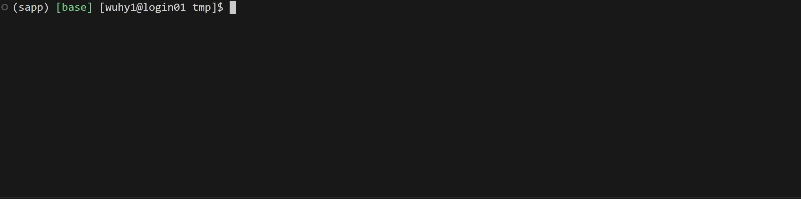

# SAPP

`sapp` is a command helper for slurm system. It allows you to act as if you are on compute node (with Internet!). No need to learn how to use slurm.

## How to use

### Quick Start

Use `spython` to replace `python` and your applications will run on the compute node.

You will be asked to select a compute node for the first time. `sapp` will show the partition, type of cards and how many resources are available. After that, `sapp` will remember your choice and next time you may select this config with one click.

<div align=center>
    
</div>

### Advanced Usage

If you want to execute commands other that `python`, just add `sapp` in front of your command. Actually, `spython` is just a shortcut for `sapp python`. For example, use `sapp bash train.sh` to run `bash train.sh` on the compute node.

<div align=center>
    
</div>

By default, sapp will do port forwarding for you. You will be able to use the Internet on the compute node as if you are on your local machine.

### Clash

`sapp` has a built-in clash client. Use command `clash` to set up the service, or add `-b` to run in the background. The usage is the same as the [official clash client](https://a76yyyy.github.io/clash/).

With the help of clash, you may connect to any websites on the compute node. Just set up a clash service and fill in the port number in your sapp submission form.

<div align=center>
    
</div>

You may also use clash without sapp.

## Install

```sh
pip install git+https://github.com/why-in-Shanghaitech/sapp.git
```

## Uninstall

```sh
pip uninstall sapp
```

## Features

 - Free yourself from long commands and slurm settings. Personally, I do not like typing a long command or executing a shell script with no interactive console.
 - Beautiful `tqdm` progress bar for `srun` interactive jobs.
 - Sapp allows you to run `srun` and `sbatch` without worrying about file changes. It will memorize the file you submit, so feel free to change the scripts or config files after submitting the job, even if it does not start running yet.
 - Sapp could do auto port forwarding -- enjoy the Internet on the compute node!
 - Sapp will set up clash for you. Use command `clash` to run a clash service.

## How it works

 - The GPU status query is based on the command `sinfo`.
 - The Internet service is based on clash and ssh port forwarding.


